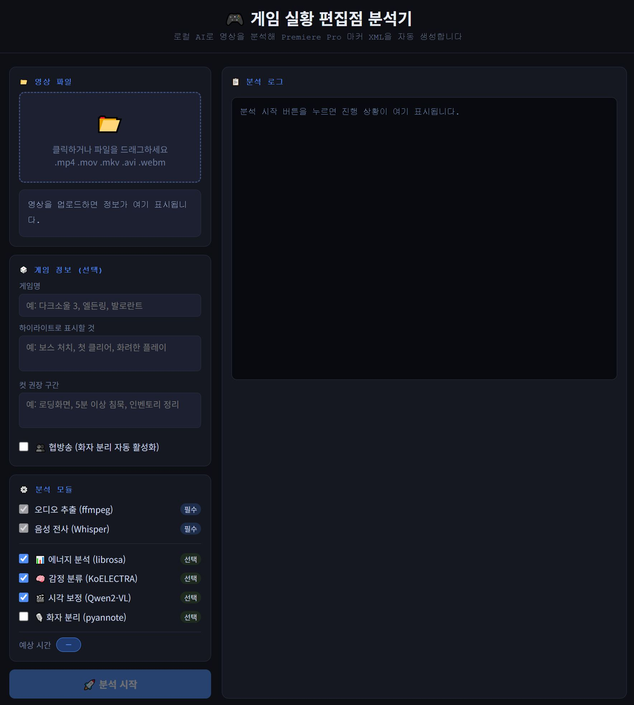

# 🎮 게임 실황 편집점 자동 분석기

> 로컬 AI로 게임 실황 영상을 분석해 **Premiere Pro 마커 XML을 자동 생성**하는 도구입니다.  
> 영상이 외부 서버로 전송되지 않으며, 모든 처리는 본인 PC에서 이루어집니다.

---

## 데모 UI



---

## 주요 기능

| 기능 | 설명 |
|------|------|
| 🎵 음성 전사 | Whisper medium/large-v3으로 전체 발화를 타임코드와 함께 추출 |
| 📊 에너지 분석 | librosa로 RMS 에너지 피크·침묵 구간·피치 스파이크 감지 |
| 🧠 감정 분류 | KoELECTRA로 발화별 흥분·실패·웃음·당황 감정 분류 |
| 🎬 시각 보정 | Qwen2-VL 2B로 후보 구간 장면 이해 (승리/로딩/전투 등) |
| 🎙️ 화자 분리 | pyannote로 협방송 실況자 발화만 필터링 |
| 🏷️ 라벨 분류 | Green/Yellow/Orange/Blue/Red 5단계 마커 자동 부여 |
| 📄 XML 출력 | Premiere Pro에서 바로 임포트 가능한 FCP7 XMEML 생성 |

---

## 마커 색깔 기준

| 색깔 | 의미 | 판정 기준 |
|------|------|-----------|
| 🟢 Green | 하이라이트 | 감정 0.8↑ + 에너지 0.75↑ |
| 🟡 Yellow | 강조 후보 | 감정 0.6↑ 또는 감탄사 감지 |
| 🟠 Orange | 전환점 | 도입부 임팩트, 자연스러운 컷 포인트 |
| 🔵 Blue | 일반 구간 | 편집 여부 검토 필요 |
| 🔴 Red | 컷 권장 | 15초↑ 침묵, 로딩 화면, 컷 신호 감지 |

---

## 시스템 요구사항

| 항목 | 최소 | 권장 |
|------|------|------|
| GPU | RTX 2070 (8GB VRAM) | RTX 3060 이상 (12GB) |
| RAM | 16GB | 32GB |
| Python | 3.10 | 3.11 |
| OS | Windows 10 | Windows 11 |
| 저장공간 | 20GB (모델 포함) | 50GB |

---

## 설치 방법

### 1. 사전 설치

**Python 3.11**
- [python.org](https://www.python.org/downloads/) 에서 다운로드
- 설치 시 "Add to PATH" 반드시 체크

**ffmpeg**
```powershell
winget install Gyan.FFmpeg
```
설치 후 PowerShell 재시작 → `ffmpeg -version` 으로 확인

### 2. 저장소 클론

```powershell
git clone https://github.com/본인계정/game_clip_analyzer.git
cd game_clip_analyzer
```

### 3. 가상환경 생성 및 패키지 설치

```powershell
python -m venv venv
venv\Scripts\activate

# PyTorch (CUDA 12.8용 GPU 버전)
pip install torch torchvision torchaudio --index-url https://download.pytorch.org/whl/cu128

# 나머지 패키지
pip install ffmpeg-python numpy
pip install openai-whisper
pip install librosa soundfile
pip install transformers accelerate bitsandbytes
pip install gradio
```

### 4. GPU 인식 확인

```powershell
python -c "import torch; print(torch.cuda.is_available(), torch.cuda.get_device_name(0))"
# 출력: True  NVIDIA GeForce RTX ****
```

### 5. VRAM 8GB 사용자 설정 (RTX 2070/2080 등)

`config.py` 에서 Whisper 모델을 변경합니다:

```python
# config.py
WHISPER_MODEL = "medium"   # 기본값 "large-v3" → 8GB VRAM에서는 medium 권장
```

---

## 사용 방법

### Gradio 웹 UI (권장)

```powershell
venv\Scripts\activate
python gradio_app.py
```

브라우저에서 `http://localhost:7860` 자동 오픈됩니다.

1. 영상 파일 드래그 앤 드롭
2. 게임명·하이라이트 기준 입력 (선택)
3. 분석 모듈 ON/OFF
4. **분석 시작** 클릭
5. 완료 후 **XML 다운로드**
6. Premiere Pro → `파일 > 가져오기` → 다운로드한 XML 선택

### CLI (터미널)

```powershell
venv\Scripts\activate

# 대화형 UI
python main.py

# 경로 직접 전달
python main.py "D:\recordings\game_vod.mp4"

# UI 없이 기본값으로 실행
python main.py "game_vod.mp4" --no-ui
```

---

## 파일 구조

```
game_clip_analyzer/
├── config.py                    # 전역 설정 (모델명, 가중치, 임계값)
├── main.py                      # CLI 진입점
├── gradio_app.py                # 웹 UI
├── requirements.txt
│
├── core/
│   ├── video_inspector.py       # ffprobe 영상 메타데이터 분석
│   └── time_estimator.py        # 예상 처리 시간 계산
│
├── pipeline/
│   ├── audio_extractor.py       # ffmpeg 오디오 추출
│   ├── whisper_transcriber.py   # Whisper 음성 전사 (청크 단위)
│   ├── energy_detector.py       # librosa 에너지/침묵/피치 분석
│   ├── emotion_analyzer.py      # KoELECTRA 감정 분류
│   ├── visual_analyzer.py       # Qwen2-VL 시각 보정
│   └── speaker_separator.py     # pyannote 화자 분리
│
├── scoring/
│   ├── exclamation_detector.py  # 한국어 감탄사 패턴 감지
│   ├── scorer.py                # 앙상블 점수 계산
│   └── labeler.py               # Green/Yellow/Red 라벨 분류
│
├── output/
│   └── xml_exporter.py          # FCP7 XMEML 생성
│
└── ui/
    └── module_selector.py       # CLI 모듈 선택 UI
```

---

## 처리 흐름

```
영상 파일
    ↓
video_inspector   ← ffprobe로 메타데이터 파악
    ↓
audio_extractor   ← ffmpeg로 16kHz mono WAV 추출
    ↓
whisper_transcriber  ← 30분 청크 단위 전사 + JSON 캐시
    ↓
[선택] speaker_separator  ← 협방송 실況자 발화 필터링
    ↓
energy_detector   ← RMS 에너지·침묵·피치 분석
    ↓
exclamation_detector  ← 한국어 감탄사 패턴 감지
    ↓
[선택] emotion_analyzer   ← KoELECTRA 감정 분류
    ↓
scorer            ← 앙상블 최종 점수 계산
    ↓
[선택] visual_analyzer    ← Qwen2-VL 후보 구간 시각 보정
    ↓
labeler           ← 색깔 라벨 분류
    ↓
xml_exporter      ← Premiere Pro용 XML 출력
```

---

## 캐시 시스템

분석 중단 후 재시작해도 완료된 단계는 스킵합니다.  
캐시 파일은 `.cache/` 폴더에 저장되며, 영상별로 독립 관리됩니다.

| 캐시 파일 | 내용 |
|-----------|------|
| `*_audio.wav` | 추출된 오디오 |
| `*_transcript.json` | Whisper 전사 결과 |
| `*_chunk_NNN.json` | 청크별 전사 (30분 단위) |
| `*_energy.json` | 에너지 분석 결과 |
| `*_visual.json` | Qwen 시각 판정 결과 |
| `*_speakers.json` | 화자 분리 결과 |

강제 재분석이 필요하면 `.cache/` 폴더를 삭제하거나 각 함수에 `force=True`를 전달합니다.

---

## 화자 분리 (협방송)

pyannote 사용을 위해 HuggingFace 계정과 라이선스 동의가 필요합니다.

1. [HuggingFace](https://huggingface.co/) 계정 생성
2. [pyannote/speaker-diarization-3.1](https://huggingface.co/pyannote/speaker-diarization-3.1) 페이지에서 라이선스 동의
3. Access Token 발급 후 환경변수 설정:

```powershell
$env:HUGGINGFACE_TOKEN = "hf_your_token_here"
```

---

## 라이선스

MIT License

---

## 기여

Issue와 PR 환영합니다.  
버그 제보 시 영상 길이, GPU 모델, 오류 메시지를 함께 알려주시면 빠르게 확인합니다.
